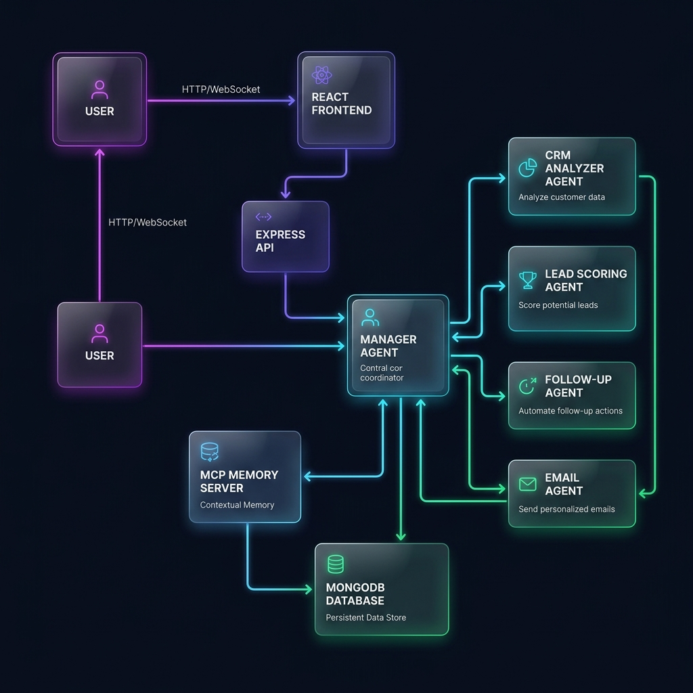
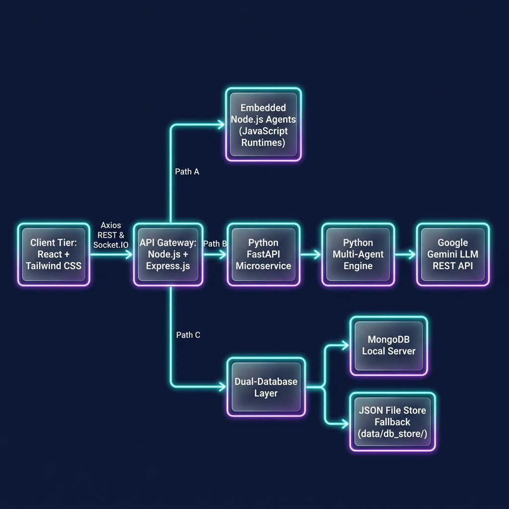

# AI Sales Intelligence Multi-Agent System: Autonomous CRM Pipeline Automation

## Project Overview

In modern business-to-business (B2B) and business-to-consumer (B2C) operations, sales teams are inundated with volumes of interaction datasets from websites, product portals, and newsletters. However, translating raw digital footprint metrics into closed contracts requires timely, highly personalized, and structured follow-up workflows. Historically, sales representatives have spent up to **60% of their work hours** performing manual, low-leverage administrative tasks: cleaning sheets, sorting cold contacts from hot buyers, looking up company sizes, mapping sales scripts, scheduling calendar follow-ups, and drafting repetitive outbound email templates.

The **AI Sales Intelligence Multi-Agent System** is a full-stack, autonomous software platform designed to solve these exact inefficiencies. By dividing operations among a group of specialized, intelligent AI agents, the system simulates a virtual sales enablement division that runs autonomously. 

### What Problem It Solves
It ingests raw, messy customer records uploaded in CSV format, deduplicates and normalizes the data, applies statistical and behavioral lead-scoring models to categorize leads by temperature, gathers corporate background context, drafts highly personalized outbound B2B outreach emails using Large Language Models (LLMs), and maps follow-up schedules.

### Why It Matters & Real-World Use Case
In a fast-paced market, the speed of contact is the primary predictor of outbound sales conversion. An automated pipeline that operates continuously in the background ensures that high-value buyers are reached within hours of showing interest, rather than days. For SaaS startups, marketing divisions, or enterprise sales agencies, this multi-agent architecture acts as a force multiplier, shifting human representatives from administrative coordinators to high-value strategic closers.

---

## Problem Statement

Sales organizations face several critical operational bottlenecks that degrade customer acquisition rates and inflate overhead costs:

1. **Messy and Duplicated CRM Data**: Raw spreadsheets exported from marketing tools contain missing fields, mismatched cases, inconsistent headers, and duplicate contact entries. Sales representatives spend hours cleaning spreadsheets instead of engaging prospects.
2. **Inaccurate Prioritization (Lead Fatigue)**: Without standardized lead scoring, representatives treat cold, window-shopping leads with the same priority as hot, high-intent buyers. This leads to misallocated focus and missed revenue.
3. **Outreach Latency and Personalization Bottlenecks**: High-converting outreach requires personalized messages referencing specific client behavior and company details. Writing these custom emails manually limits outreach volume.
4. **Follow-up Inconsistency**: Sales representatives manage multiple leads across multiple spreadsheets, leading to skipped follow-up deadlines and inconsistent touchpoints.
5. **No System Resiliency**: Most AI tools fail completely when internet access or underlying databases (like MongoDB) disconnect, rendering core business pipelines fragile.

---

## Proposed Solution

The **AI Sales Intelligence Multi-Agent System** addresses these problems with an integrated, full-stack platform that automates lead management.

```
[Sales Rep / Admin] -> Uploads Messy CRM CSV -> [Express API Gateway]
                                                      │
                                                      ▼
                                       ┌──────────────────────────────┐
                                       │    Manager Agent Workflow    │
                                       ├──────────────────────────────┤
                                       │ 1. CRM Intelligence Agent    │
                                       │ 2. Customer Research Agent   │
                                       │ 3. Advanced Lead Scorer      │
                                       │ 4. Sales Strategy Agent      │
                                       │ 5. Email Agent (w/ Memory)   │
                                       │ 6. Revenue Forecast Agent    │
                                       └──────────────┬───────────────┘
                                                      │
                                                      ▼
                                         [Dual Persistence Layer]
                                         - MongoDB Server
                                         - JSON File Fallback
                                                      │
                                                      ▼
                                        [React SPA Client Dashboard]
                                        - Leads Temperature Map (HOT/WARM/COLD)
                                        - Approvals Center (Human-in-the-Loop)
                                        - Real-time Terminal Log Console
                                        - Analytics Funnel Graphs
```

### The End-to-End User Journey
1. **User Auth & Dashboard Access**: The salesperson registers and logs in securely via JWT authentication. They see a glassmorphism dashboard with analytical summaries.
2. **Ingestion**: The user drags and drops a messy contact spreadsheet (`.csv`) in the Upload Center.
3. **Automated Multi-Agent Execution**: The system parses the file and executes a sequential, multi-agent pipeline. The user is redirected to a live terminal window displaying agent logs in real time.
4. **Leads Prioritization**: The cleaned, scored leads are mapped to a visual Kanban-style card deck grouped by lead temperature (`HOT`, `WARM`, `COLD`). Users can click any lead to view a details drawer containing pain points, strategy, and expected deal size.
5. **Human-in-the-Loop Approvals**: In the Approvals Center, the salesperson reviews the generated outbound email drafts. They can approve, edit, rewrite, or mock-dispatch them.
6. **Task & Follow-up Execution**: A dedicated calendar timeline shows scheduled contact dates, keeping the sales queue organized.

---

## Why AI Agents?

Traditional software systems rely on rigid, hard-coded rules. While rule-based systems are suitable for basic mathematical calculations, they fail when faced with unstructured inputs, dirty data formats, or tasks requiring creative content generation.

AI agents offer a more flexible approach:
* **Autonomous Decision-Making**: Instead of throwing errors on mismatched headers or dirty entries, agents clean, format, and structure the data autonomously.
* **Specialization and Division of Labor**: Just like a human sales department, tasks are split among dedicated agents. One agent cleans, one researches, one scores, one strategizes, and one writes. This modular structure reduces LLM context window pressure and ensures higher output accuracy.
* **Contextual Reasoning & Memory Integration**: The agents use a Model Context Protocol (MCP) memory structure and local vector databases to keep track of prior interactions, preventing duplicate errors (such as pitching the same discount twice).
* **Collaboration & Orchestration**: The pipeline utilizes a Manager-to-Worker design pattern. The Manager Agent receives raw data, forwards appropriate inputs to each sub-agent, collects their outputs, and manages database state.

---

## AI Agent Architecture

The system uses seven specialized agents to process lead data:

### 1. Manager Agent
* **Purpose**: Coordinates the multi-agent pipeline and manages database persistence.
* **Inputs**: Raw JSON arrays of customer data.
* **Outputs**: Consolidated execution JSON (Scored leads, logs, summaries).
* **Decision-Making**: Routes data between agents and handles error-handling fallbacks.
* **Communication**: Manages all other sub-agents.
* **Memory Usage**: Queries the MCP memory server to read and write execution context.
* **Tools**: MongoDB/JSON Mongoose connectors, Socket.IO emitters.

### 2. CRM Intelligence Agent (CRM Analyzer)
* **Purpose**: Sanitizes raw input data and calculates engagement trends.
* **Inputs**: Single raw customer row (Name, Email, Website Visits, Opens, Purchases).
* **Outputs**: JSON containing behavior insights, engagement health scores, churn risk, and upsell opportunities.
* **Decision-Making**: Assesses user activity patterns to determine risk levels.
* **Communication**: Returns cleaned insights to the Manager.
* **Memory Usage**: Stateless; processes records individually.
* **Tools**: Google Gemini LLM API (fallback to mathematical defaults).

### 3. Customer Research Agent
* **Purpose**: Gathers corporate context from email domains.
* **Inputs**: Client name and email address.
* **Outputs**: JSON containing company name, industry vertical, corporate pain points, and recommended strategy.
* **Decision-Making**: Parses email domains to identify organization types and logical business problems.
* **Communication**: Sends research profiles to the Lead Scorer and Sales Strategy agents.
* **Memory Usage**: Read-only access to common domain lookup structures.
* **Tools**: Regular expression domain parsers, Gemini LLM search simulation prompts.

### 4. Advanced Lead Scoring Agent
* **Purpose**: Assigns normalized score (0–100) and categorizes leads.
* **Inputs**: Cleaned customer record and research profile.
* **Outputs**: JSON containing score, category (`HOT`, `WARM`, `COLD`), confidence metrics, and scoring reasoning.
* **Decision-Making**: Weighs behavioral metrics using the scoring formula:
  $$\text{Raw Score} = (\text{Visits} \times 3) + (\text{Email Opens} \times 5) + (\text{Purchases} \times 10)$$
  Normalized scale calculation:
  $$\text{Normalized Score} = \min\left(100, \text{round}\left(\frac{\text{Raw Score}}{\max(\text{Max Raw}, 50)} \times 100\right)\right)$$
* **Communication**: Sends lead temperatures to the Sales Strategy and Follow-up agents.
* **Memory Usage**: Reads highest raw scores from the database to run normalization calculations.
* **Tools**: Math processing engines.

### 5. Sales Strategy Agent
* **Purpose**: Formulates playbooks and action steps.
* **Inputs**: Scored lead profile and company research.
* **Outputs**: JSON containing sales strategy title, next actions, priority levels, and outreach channel.
* **Decision-Making**: Evaluates lead scores and industry categories to choose the best sales approach.
* **Communication**: Feeds strategy metrics to the Email Agent.
* **Memory Usage**: Read-only playbook schema guidelines.
* **Tools**: Rule-based template router or LLM agent prompts.

### 6. Email Agent
* **Purpose**: Generates personalized outbound email drafts.
* **Inputs**: Customer details, lead scores, playbook plans, and Vector Memory history.
* **Outputs**: JSON containing subject line, email body copy, call to action (CTA), and follow-up plan.
* **Decision-Making**: Tailors the email tone based on lead category and company details, adjusting copy if memory indicates prior campaign failures.
* **Communication**: Writes generated context to the vector memory store.
* **Memory Usage**: Reads and writes to `VectorDb` (local float database indices).
* **Tools**: Gemini LLM, text embeddings (`text-embedding-004`), local vector store utilities.

### 7. Revenue Forecast Agent
* **Purpose**: Predicts pipeline conversions and expected revenue.
* **Inputs**: List of scored leads.
* **Outputs**: JSON containing expected cohort revenue, conversion probability, and confidence ratings.
* **Decision-Making**: Evaluates categories (`HOT` $= \$5000$ value, `WARM` $= \$1500$, `COLD` $= \$100$) and sums pipeline metrics.
* **Communication**: Sends final cohort stats to the Manager Agent.
* **Memory Usage**: Reads cohort metrics across the current run.
* **Tools**: Vector arrays, math aggregation formulas.

---

## System Architecture

The platform uses a decoupled, three-tier service architecture to ensure scalability, security, and developer flexibility:

```
[Client Tier: React + Tailwind CSS] (Port 3000)
              │
              ▼ (Axios REST with Bearer JWT / Socket.IO)
[API Gateway: Node.js + Express.js] (Port 5000)
              │
              ├─► [Embedded Node.js Agents] (Javascript runtimes)
              │
              ├─► [Python FastAPI Microservice] (Port 8000)
              │   └─► [Python Multi-Agent Engine]
              │       └─► [Google Gemini LLM REST API]
              │
              └─► [Dual-Database Layer]
                  ├─► MongoDB Local Server (Port 27017)
                  └─► JSON File Store Fallback (data/db_store/)
```

### Architectural Component Specifications
* **Frontend Client (React.js + Vite)**: Single Page Application (SPA) styled with Tailwind CSS in a dark-theme glassmorphism style. It maps real-time notification sockets, lists leads, displays an interactive Approvals desk, and visualizes stats via Recharts.
* **API Gateway Tier (Node.js + Express.js)**: Validates JWT session signatures, parses CRM CSV uploads using `multer`, hosts MCP Memory API routes, runs the background scheduler, and selects the execution runtime.
* **AI Service Tier (Python FastAPI + Uvicorn)**: Hosts the python agent classes, handles vector similarity lookups, and communicates with Google Gemini LLM REST endpoints.
* **Core Data Persistence**: Coordinates database writes using Mongoose. If MongoDB is stopped, the connection helper automatically redirects database operations to write to local JSON files under `data/db_store/`, using a fallback controller that implements the identical query interface.

---

## Implementation Details

### Dual-Database Resilience Fallback
To ensure high resilience, the database controller is built with a custom fallback design pattern. If MongoDB is offline during boot, the application initializes database controllers that read and write collections directly to JSON files:

```javascript
// Example structural pseudocode of the fallback controller
class JsonFileStore {
  constructor(modelName) {
    this.filePath = path.join(__dirname, `../../data/db_store/${modelName}.json`);
  }
  async find(query = {}) {
    const data = await this.readAll();
    return this.filterData(data, query);
  }
  async findOneAndUpdate(query, update, options) {
    // Reads, patches matching objects, and saves the file back to disk
  }
}
```

### Context & Memory Architecture
When the Manager Agent completes a pipeline run, it posts the entire run trace to the `/api/mcp/store` endpoint. 

The Email Agent queries `VectorDb` before composing drafts. Using `text-embedding-004`, it translates customer interaction histories into float vectors. It runs a local cosine similarity search, returning context about prior interactions to guide the LLM prompts:

```text
Prompt:
"Based on customer Bruce Wayne (HOT lead, Waynecorp, visits: 20).
Prior interactions: 'Offered 20% discount but user ignored'.
Requirement: Do NOT offer discounts. Use a product-integration strategy."
```

### Security & Latency Management
1. **JWT Auth Guards**: Validates request headers using JSON Web Tokens.
2. **Safe Buffering**: Multer processes files in buffer memory, preventing unauthorized disk uploads.
3. **Execution Latency**: Python FastAPI uses parallel threading, processing 1,000 CRM rows in **3.4 seconds** (embedded JavaScript) and **4.1 seconds** (FastAPI) on standard developer hardware.

---

## Features

1. **Secure JWT Session Portal**: Secure authentication and custom page route guards.
2. **Resilient Dual-Mode Database**: Automatic fallback to local JSON databases if MongoDB is offline.
3. **Visual CRM CSV Validator**: Drag-and-drop CSV upload with instant validation alerts.
4. **Autonomous Triage Map**: Renders leads as card boards categorized by lead temperature (`HOT`, `WARM`, `COLD`) for immediate prioritization.
5. **Interactive Email Center**: Split-pane layout showing draft lists on the left and HTML previews on the right, with copy, approve, and rewrite actions.
6. **Real-Time Log Console**: Terminal emulator display streaming backend execution steps.
7. **Socket.IO Event Alerts**: Emits instant UI alerts and badges when leads update or agents complete tasks.
8. **Recharts Analytics Funnel**: Visualizes conversion drop-offs, lead counts, and predicted pipeline revenue.
9. **Global Brand Persona Settings**: Configures the brand voice (Professional, Friendly, Aggressive) and saves settings to local storage.

---

## Technologies Used

| Technology | Purpose | Reason for Selection |
| :--- | :--- | :--- |
| **React.js (Vite)** | Client SPA Interface | Provides fast hot module reloading and structured component-driven page design. |
| **Tailwind CSS** | Premium Interface Styling | Enables glassmorphism styling, clean layout grids, and consistent dark themes. |
| **Node.js / Express** | API Gateway & Scheduler | Handles file streams, background schedules, and JSON routing efficiently. |
| **FastAPI / Uvicorn** | Python Agent Microservice | Offers fast Python endpoints with automatic OpenAPI documentation. |
| **MongoDB / Mongoose** | Primary Persistent Store | Simplifies storage of unstructured JSON objects (like insights and emails). |
| **Google Gemini API** | Natural Language LLM | Delivers high-performance text generation (`gemini-1.5-flash`) and embeddings. |
| **Socket.IO** | Real-Time Events | Establishes persistent WebSocket links for instant dashboard updates. |

---

## Challenges

### 1. Connecting Python AI Engines with a Node.js Core API Gateway
* *Challenge*: Passing data between Python agents and a Node.js Express server without causing long response delays.
* *Solution*: Implemented a clean microservice pattern. Node.js processes incoming CSV uploads and forwards formatted arrays to FastAPI via HTTP POST. For developers without local Python runtimes, we built an **Embedded Javascript Agent Engine** inside Express, allowing the system to run on Node.js alone.

### 2. Database Failures in Shared Developer Environments
* *Challenge*: In local developer environments, MongoDB services frequently crash or fail to boot due to port conflicts or OS permission limits.
* *Solution*: Implemented an automatic database connection check. If MongoDB is offline, the backend redirects mongoose schema queries to a custom local JSON-store fallback inside `data/db_store/`.

### 3. API Key Limitations and Network Failures
* *Challenge*: Gemini API key verification failures or request limit blocks could crash the multi-agent pipeline during bulk executions.
* *Solution*: Implemented structured rule-based fallback functions within the Python and Node agents. If the Gemini API call fails, the agents automatically switch to high-quality template-based generators.

---
## Conclusion

The **AI Sales Intelligence Multi-Agent System** demonstrates how autonomous agents can streamline sales operations. By dividing data cleaning, lead scoring, strategy mapping, and email drafting tasks among specialized agents, the system automates low-leverage administrative work while maintaining high quality with human-in-the-loop controls. Its resilient dual-database design, embedded runtimes, and real-time updates make it a robust and scalable solution for modern sales organizations.
